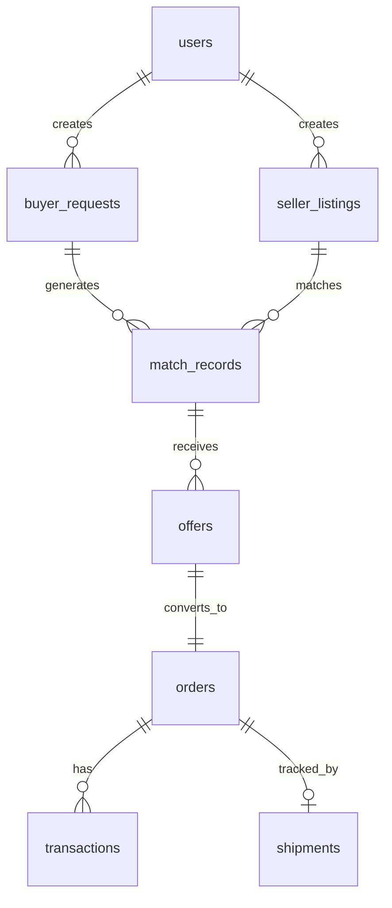

# 🎯 Laravel Marketplace Pro Bootstrap Script

> **One-command Laravel marketplace setup with Vue, Inertia, Filament Admin, Stripe payments, and complete concierge marketplace features.**

[](https://opensource.org/licenses/MIT)
[](https://laravel.com/)
[](https://vuejs.org/)
[](https://filamentphp.com/)

## 🚀 Quick Start

```bash
# Download the script
wget https://raw.githubusercontent.com/wjak-official/laravel-marketplace-pro/main/installer.sh

# Make it executable
chmod +x installer.sh

# Run with default settings
./installer.sh

# Or with custom app directory
./installer.sh my-marketplace
```

## 📋 Table of Contents

- [Features](#-features)
- [Requirements](#-requirements)
- [Installation Guide](#-installation-guide)
- [Configuration](#-configuration)
- [Architecture Overview](#-architecture-overview)
- [Usage Tutorial](#-usage-tutorial)
- [FAQ](#-frequently-asked-questions)
- [Troubleshooting](#-troubleshooting)
- [Contributing](#-contributing)
- [License](#-license)

## ✨ Features

### 🏪 **Complete Marketplace Platform**
- **Seller Onboarding**: Story-card wizard for listing creation
- **Buyer Concierge**: AI-powered matching and sourcing
- **Single Point of Contact**: Platform handles all communication
- **Unified Billing**: One invoice for all transactions

### 🔧 **Technical Stack**
- **Backend**: Laravel 10.x with robust API architecture
- **Frontend**: Vue 3 + Inertia.js for seamless SPA experience
- **Admin Panel**: Filament 3.x with comprehensive management tools
- **Payments**: Stripe integration with webhook support
- **Security**: CSRF protection, role-based access, security headers

### 🎨 **User Experience**
- **Responsive Design**: Mobile-first Tailwind CSS styling
- **Smooth Animations**: AOS (Animate On Scroll) + Lenis smooth scrolling
- **Progressive UI**: Step-by-step wizards with progress tracking
- **Real-time Updates**: Live status updates and notifications

### 📊 **Business Features**
- **Multi-Role System**: Admin, Buyer, Seller, Agent roles
- **Order Management**: Complete order lifecycle tracking
- **Logistics Integration**: Shipment tracking and management
- **Analytics Ready**: Database structure for reporting

## 📦 Requirements

### System Requirements
- **PHP**: 8.1+ with extensions: `mbstring`, `xml`, `ctype`, `json`, `bcmath`, `openssl`, `pdo`, `tokenizer`
- **Database**: MySQL 5.7+ / PostgreSQL 10+ / SQLite 3.8.8+
- **Web Server**: Apache / Nginx
- **Node.js**: 18+ for asset compilation
- **Composer**: 2.0+ for dependency management

### Optional Tools
- **rsync**: For efficient file copying (auto-detected)
- **Git**: For version control setup
- **Redis**: For caching and sessions (configurable)

### Environment Support
- ✅ **Local Development**: XAMPP, Laragon, Valet, Sail
- ✅ **Docker**: Devilbox, Laradock, custom containers
- ✅ **Production**: Any standard PHP hosting
- ✅ **Cloud**: AWS, DigitalOcean, Heroku, etc.

## 🛠 Installation Guide

### Step 1: Download and Setup

```bash
# Clone or download the script
git clone https://github.com/wjak-official/laravel-marketplace-pro.git
cd laravel-marketplace-pro

# Make script executable
chmod +x installer.sh
```
## 🛠 Configuration

### Step 2: Configure Environment Variables

Before running the script, open the script using your text editor and set the environment variables as per your pre-configured environment:

```bash
# Database Configuration
export DB_CONNECTION="mysql"
export DB_HOST="127.0.0.1"
export DB_PORT="3306"
export DB_DATABASE="marketplace_pro"
export DB_USERNAME="root"
export DB_PASSWORD="your_password"

# Application Settings
export APP_URL="http://localhost"
export APP_CURRENCY="USD"

# Admin Account
export ADMIN_EMAIL="admin@marketplace.local"
export ADMIN_PASSWORD="SecurePassword123!"

# Stripe Configuration (get from Stripe Dashboard)
export STRIPE_KEY="pk_test_your_publishable_key"
export STRIPE_SECRET="sk_test_your_secret_key"
export STRIPE_WEBHOOK_SECRET="whsec_your_webhook_secret"

# Fees (in cents)
export APP_FEE_SELLER_LISTING="499"  # $4.99
export APP_FEE_BUYER_REQUEST="499"   # $4.99

# Optional: Custom directories
export HTDOCS_DIR="/path/to/your/webroot"
```

### Step 3: Run the Bootstrap Script

```bash
# Basic installation
./installer.sh

# Custom app directory
./installer.sh my-custom-marketplace

# With specific environment
DB_PASSWORD="mypassword" ./installer.sh marketplace-pro
```

### Step 4: Complete Setup

1. **Configure Stripe Webhooks**:
   - Go to Stripe Dashboard → Webhooks
   - Add endpoint: `https://your-domain.com/stripe/webhook`
   - Select events: `checkout.session.completed`

2. **Set File Permissions** (if needed):
   ```bash
   chmod -R 755 storage bootstrap/cache
   chown -R www-data:www-data storage bootstrap/cache
   ```

3. **Configure Web Server**:
   - Point document root to `public/` directory
   - Enable URL rewriting for Laravel routes

## ⚙️ Configuration

### Environment Variables Reference

| Variable | Default | Description |
|----------|---------|-------------|
| `APP_URL` | `https://your-app-url.tld` | Your application URL |
| `DB_CONNECTION` | `mysql` | Database type |
| `DB_HOST` | `127.0.0.1` | Database host |
| `DB_PORT` | `3306` | Database port |
| `DB_DATABASE` | `marketplace_pro` | Database name |
| `DB_USERNAME` | `root` | Database username |
| `DB_PASSWORD` | *(empty)* | Database password |
| `ADMIN_EMAIL` | `admin@marketplace.mynet` | Admin account email |
| `ADMIN_PASSWORD` | `Admin12345!` | Admin account password |
| `APP_CURRENCY` | `USD` | Platform currency |
| `APP_FEE_SELLER_LISTING` | `499` | Seller activation fee (cents) |
| `APP_FEE_BUYER_REQUEST` | `499` | Buyer activation fee (cents) |
| `STRIPE_KEY` | *(required)* | Stripe publishable key |
| `STRIPE_SECRET` | *(required)* | Stripe secret key |
| `STRIPE_WEBHOOK_SECRET` | *(required)* | Stripe webhook secret |

### Directory Structure
```
marketplace-pro/
├── app/
│   ├── Filament/Resources/     # Admin panel resources
│   ├── Http/Controllers/       # API and web controllers
│   ├── Models/                 # Eloquent models
│   └── Policies/              # Authorization policies
├── database/
│   ├── migrations/            # Database schema
│   └── seeders/              # Initial data
├── resources/
│   ├── js/
│   │   ├── Layouts/          # Vue layout components
│   │   └── Pages/            # Vue page components
│   └── css/                  # Tailwind styles
└── routes/
    └── web.php               # Application routes
```

## 🏗 Architecture Overview

### Database Schema



### Key Models

#### 🛍️ **SellerListing**
```php
// Core fields
- title, description, category, condition
- price_min, price_max, currency
- status (draft/pending_review/active/reserved/sold/archived)
- photos (JSON), attributes (JSON)
- pickup location (city, lat/lng)
- availability window
```

#### 🎯 **BuyerRequest**
```php
// Core fields  
- query, category, details
- budget_min, budget_max, currency
- allow_external_sources (boolean)
- must_haves, nice_to_haves (JSON)
- delivery location (city, lat/lng)
- status (draft/active/fulfilled/expired)
```

#### 🔗 **MatchRecord**
```php
// Connects buyers and sellers
- buyer_request_id, seller_listing_id
- score (0-100), source (internal/external)
- status (suggested/viewed/declined/interested)
- external_payload (JSON for external sources)
```

#### 💰 **Order & Transaction**
```php
// Order lifecycle
- offer_id, buyer_id, seller_id
- status (pending_payment/paid/shipped/delivered/completed)
- stripe_payment_intent_id
- related transactions for escrow/payouts
```

### Frontend Architecture

#### 🎨 **Vue 3 + Inertia.js**
- **Layouts**: `PublicLayout` (marketing) + `AppLayout` (user portal)
- **Pages**: Organized by role (`Public/`, `App/`, `Seller/`, `Buyer/`)
- **Components**: Reusable UI components with Tailwind classes
- **State**: Inertia shared data for user context

#### 🎪 **Progressive Wizards**
- **Seller Wizard**: 6-step listing creation with real-time saving
- **Buyer Concierge**: 6-step requirement gathering
- **Progress Tracking**: Visual progress bars and step indicators
- **Draft Auto-save**: Prevents data loss during onboarding

## 📚 Usage Tutorial

### For Sellers: Creating Your First Listing

1. **Register/Login** → Go to `/sell/wizard`
2. **Step 1 - Basic Info**: Enter title, category, condition
3. **Step 2 - Description**: Tell your item's story
4. **Step 3 - Pricing**: Set min/max price expectations  
5. **Step 4 - Location**: Specify pickup area
6. **Step 5 - Details**: Add brand, model, attributes
7. **Step 6 - Activate**: Pay $4.99 activation fee
8. **Result**: Status becomes "pending_review" → Admin approves → "active"

### For Buyers: Finding What You Need

1. **Register/Login** → Go to `/buy/concierge`
2. **Step 1 - What**: Describe what you're looking for
3. **Step 2 - Requirements**: Must-haves vs nice-to-haves
4. **Step 3 - Budget**: Set your price range
5. **Step 4 - Sourcing**: Allow external sources or internal only
6. **Step 5 - Delivery**: Specify delivery location
7. **Step 6 - Activate**: Pay $4.99 concierge fee
8. **Result**: Platform starts matching process

### For Admins: Managing the Platform

1. **Access Admin Panel**: `/admin` (Filament)
2. **Approve Listings**: Review seller submissions
3. **Monitor Matches**: View algorithmic matching results
4. **Manage Orders**: Track payment and fulfillment
5. **Handle Disputes**: Use built-in communication tools
6. **Analytics**: View reports and metrics

## ❓ Frequently Asked Questions

### General Questions

**Q: What makes this different from other marketplace scripts?**  
A: This is a **concierge marketplace** - the platform acts as a single point of contact between buyers and sellers. Instead of direct communication, all interactions go through the platform, which handles matching, negotiation, logistics, and billing.

**Q: Can I customize the fees?**  
A: Yes! Fees are configurable via environment variables or the admin panel. The script sets defaults of $4.99 for activation fees, but you can adjust them.

**Q: Does it work with existing Laravel projects?**  
A: The script creates a new Laravel installation. To integrate with existing projects, you can manually copy the relevant files and migrations.

### Technical Questions

**Q: Which Laravel version is supported?**  
A: The script is designed for Laravel 10.x. It may work with 11.x but hasn't been tested extensively.

**Q: Can I use a different payment processor?**  
A: Currently only Stripe is implemented, but the architecture supports adding other processors by implementing the payment interface.

**Q: Is multi-tenancy supported?**  
A: Not out of the box, but the database structure and role system make it relatively easy to add tenant isolation.

**Q: How do I add more languages?**  
A: Add language files to `resources/lang/` and use Laravel's localization features. The Vue components can be updated to use translation helpers.

### Deployment Questions

**Q: Can this run on shared hosting?**  
A: Yes, if the hosting supports Laravel requirements (PHP 8.1+, composer, etc.). You may need to adjust file paths and permissions.

**Q: What about scaling?**  
A: The architecture supports horizontal scaling. Use Redis for sessions/cache, separate database servers, and load balancers as needed.

**Q: Is Docker supported?**  
A: The script works great in Docker environments. Set the `HTDOCS_DIR` environment variable to your mounted volume path.

### Business Questions

**Q: Is this production-ready?**  
A: This is a foundation/starter kit. You'll want to add:
- Email notifications
- Advanced matching algorithms  
- Real shipping integrations
- Customer support tools
- Analytics and reporting

**Q: What's the revenue model?**  
A: Built-in fees include:
- Seller activation fees ($4.99 default)
- Buyer concierge fees ($4.99 default)  
- Order platform fees (configurable %)
- You can add subscription tiers, premium features, etc.

**Q: How do I handle disputes?**  
A: The platform acts as mediator. Add dispute resolution workflows, communication tools, and escalation procedures as needed.

## 🚨 Troubleshooting

### Common Installation Issues

#### Database Connection Errors
```bash
# Check database credentials
mysql -u root -p -h 127.0.0.1 -e "SELECT 1;"

# Create database if it doesn't exist
mysql -u root -p -e "CREATE DATABASE marketplace_pro;"

# Check Laravel .env file
cat .env | grep DB_
```

#### Permission Errors
```bash
# Fix Laravel permissions
sudo chown -R www-data:www-data storage bootstrap/cache
sudo chmod -R 775 storage bootstrap/cache

# For local development
sudo chown -R $USER:www-data storage bootstrap/cache
```

#### Node.js/NPM Issues
```bash
# Clear npm cache
npm cache clean --force

# Delete node_modules and reinstall
rm -rf node_modules package-lock.json
npm install

# Build assets
npm run build
```

### Script-Specific Issues

#### Script Fails to Execute
```bash
# Check script permissions
ls -la installer.sh

# Make executable
chmod +x installer.sh

# Check for Windows line endings
dos2unix installer.sh
```

#### Filament Installation Issues
```bash
# Manual Filament setup
composer require filament/filament:"^3.0"
php artisan filament:install --panels
```

#### Stripe Webhook Issues
```bash
# Test webhook endpoint
curl -X POST https://your-domain.com/stripe/webhook \
  -H "Content-Type: application/json" \
  -d '{"type":"test"}'

# Check webhook secret in Stripe dashboard
echo $STRIPE_WEBHOOK_SECRET
```

### Performance Issues

#### Slow Page Loads
```bash
# Enable Laravel caching
php artisan config:cache
php artisan route:cache
php artisan view:cache

# Optimize Composer autoloader
composer dump-autoload --optimize
```

#### Database Slow Queries
```sql
-- Add indexes for common queries
ALTER TABLE seller_listings ADD INDEX idx_status_category (status, category);
ALTER TABLE buyer_requests ADD INDEX idx_status_activated (status, activated_at);
ALTER TABLE match_records ADD INDEX idx_score_status (score, status);
```

### Development Issues

#### Hot Reloading Not Working
```bash
# Check Vite configuration
npm run dev

# Ensure APP_URL matches your local domain
echo $APP_URL
```

#### Vue Components Not Updating
```bash
# Clear view cache
php artisan view:clear

# Rebuild assets
npm run build
```

## 🤝 Contributing

We welcome contributions! Here's how to get started:

### Development Setup

1. **Fork and Clone**:
   ```bash
   git clone https://github.com/wjak-official/laravel-marketplace-pro.git
   cd laravel-marketplace-pro
   ```

2. **Setup Development Environment**:
   ```bash
   # Copy example environment
   cp .env.example .env.dev
   
   # Edit configuration
   nano .env.dev
   
   # Run development setup
   DB_PASSWORD="dev_password" ./installer.sh marketplace-dev
   ```

3. **Install Development Tools**:
   ```bash
   # Code quality tools
   composer require --dev phpstan/phpstan
   composer require --dev squizlabs/php_codesniffer
   
   # Frontend tools  
   npm install --save-dev @vitejs/plugin-vue
   ```

### Contribution Guidelines

#### Code Style
- **PHP**: Follow PSR-12 standards
- **JavaScript**: Use ES6+ features, async/await preferred
- **Vue**: Composition API with `<script setup>`
- **CSS**: Tailwind utility classes, minimize custom CSS

#### Commit Messages
```
feat: add external sourcing API integration
fix: resolve Stripe webhook signature validation
docs: update installation guide for Windows
refactor: simplify seller wizard state management
```

#### Pull Request Process
1. Create feature branch: `git checkout -b feature/amazing-feature`
2. Make changes with tests
3. Update documentation
4. Submit PR with clear description

### Areas for Contribution

- 🔍 **Matching Algorithms**: Improve buyer-seller matching logic
- 📧 **Notifications**: Email/SMS notification system
- 🚚 **Shipping**: Integration with shipping providers
- 📊 **Analytics**: Reporting and metrics dashboard
- 🌐 **Internationalization**: Multi-language support
- 🔒 **Security**: Additional security features
- 📱 **Mobile**: PWA features and mobile optimization

## 📄 License

This project is licensed under the MIT License - see the [LICENSE](LICENSE) file for details.

```
MIT License

Copyright (c) 2024 Laravel Marketplace Pro

Permission is hereby granted, free of charge, to any person obtaining a copy
of this software and associated documentation files (the "Software"), to deal
in the Software without restriction, including without limitation the rights
to use, copy, modify, merge, publish, distribute, sublicense, and/or sell
copies of the Software, and to permit persons to whom the Software is
furnished to do so, subject to the following conditions:

The above copyright notice and this permission notice shall be included in all
copies or substantial portions of the Software.

THE SOFTWARE IS PROVIDED "AS IS", WITHOUT WARRANTY OF ANY KIND, EXPRESS OR
IMPLIED, INCLUDING BUT NOT LIMITED TO THE WARRANTIES OF MERCHANTABILITY,
FITNESS FOR A PARTICULAR PURPOSE AND NONINFRINGEMENT. IN NO EVENT SHALL THE
AUTHORS OR COPYRIGHT HOLDERS BE LIABLE FOR ANY CLAIM, DAMAGES OR OTHER
LIABILITY, WHETHER IN AN ACTION OF CONTRACT, TORT OR OTHERWISE, ARISING FROM,
OUT OF OR IN CONNECTION WITH THE SOFTWARE OR THE USE OR OTHER DEALINGS IN THE
SOFTWARE.
```

## 🙏 Acknowledgments

- **Laravel Team**: For the amazing framework
- **Filament Team**: For the excellent admin panel
- **Vue.js Team**: For the reactive frontend framework
- **Stripe**: For reliable payment processing
- **Tailwind CSS**: For utility-first styling
- **Community**: For feedback and contributions

---

<div align="center">

**Built with ❤️ for the Laravel community**

[🐛 Report Bug](https://github.com/wjak-official/laravel-marketplace-pro/issues) • [✨ Request Feature](https://github.com/wjak-official/laravel-marketplace-pro/issues) • [💬 Discussions](https://github.com/wjak-official/laravel-marketplace-pro/discussions)

</div>
